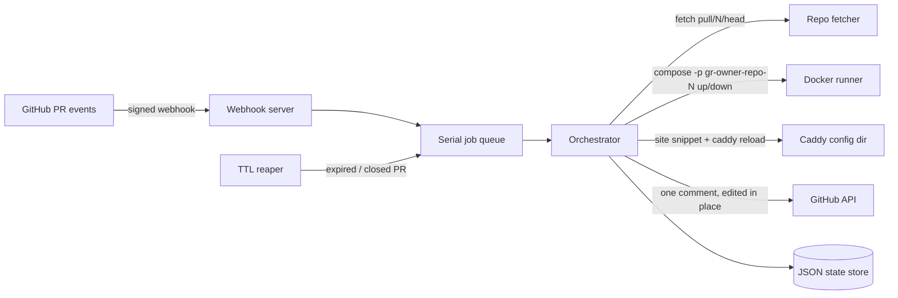

# Greenroom

[English](README.md) | [中文](README.zh.md) | [日本語](README.ja.md)

[](tests) [](LICENSE) [](CHANGELOG.md) [](package.json)

**オープンソースでセルフホストできる pull request ごとの preview environment。任意の docker compose プロジェクトで使えます。**


```bash
git clone https://github.com/JaydenCJ/greenroom.git && cd greenroom && cp .env.example .env && docker compose up -d
```

_greenroom サービス本体のアイドル時メモリは約 60 MB RSS です（Node 22 で実測。preview 側のコストはアプリ次第です）。_

## なぜ Greenroom なのか

Preview environment は、チームを Vercel に引き留める最も強力な機能でありながら、セルフホスト系プラットフォームでは最も手薄な機能です。Coolify の preview は Coolify 上にデプロイしたアプリにしか使えず、需要の大きさは Coolify v5 roadmap の preview environment issue（#5685）に集まった 663 件の reactions が示しています。`docker compose up` で起動できるアプリのために、PR ごとの URL だけを目的として PaaS を丸ごと導入する必要はないはずです。

Greenroom がやることは 1 つだけです。GitHub webhook を設定すると、各 PR が使い捨ての compose 環境になります。basic auth 付きの専用サブドメインが割り当てられ、bot コメントにリンクが貼られ、merge・close・TTL 到達で自動的に回収されます。

|  | Greenroom | Coolify | Vercel Previews | Shipyard |
|---|---|---|---|---|
| スコープ | Preview environments only | Full PaaS; previews are one feature | Feature of the Vercel cloud | Preview environments |
| セルフホスト | Yes | Yes | No | No (SaaS) |
| 任意の docker compose プロジェクト対応 | Yes | No (apps deployed on Coolify) | No (Vercel build system) | Yes |
| ライセンス | MIT | Apache-2.0 (58.1k★) | Proprietary | Proprietary |
| 料金 | Free | Free, paid cloud optional | Usage-based | Subscription |

## 特徴

- **1 PR に 1 環境** — pull request ごとに独立した `docker compose` project（`gr-<owner>-<repo>-<pr>`）が作られ、push のたびに再構築されます。owner が異なる同名リポジトリも衝突しません。
- **PR ごとの実 URL** — wildcard DNS レコード 1 本で `https://42-acme-demo-app.preview.example.com` が使えます。変更のたびに greenroom が Caddy を reload し、TLS 証明書は Caddy がホストごとに自動発行します。
- **デフォルトで非公開** — すべての preview は basic auth の背後にあります。パスワードは初回起動時にランダム生成されて 1 回だけ表示され、ディスクには bcrypt ハッシュのみが保存されます。デフォルトパスワードはありません。
- **残骸を残さない** — merge・close・TTL 到達で `compose down -v` が実行され、コンテナ・ネットワーク・volume・Caddy サイトがすべて回収されます。
- **bot コメントは 1 件だけ** — PR ごとに 1 件のコメントをその場で更新します。ステータス・リンク・commit・有効期限が載り、通知を溢れさせません。
- **PaaS へのロックインなし** — リポジトリに compose ファイルがあれば動きます。greenroom は小さなサービス 1 つと Caddy だけで、プラットフォームではありません。

## クイックスタート

まず dry-run モードでライフサイクル全体をローカルで試せます。Docker daemon・ドメイン・GitHub は不要です:

```bash
git clone https://github.com/JaydenCJ/greenroom.git && cd greenroom
npm ci && npm run build
GREENROOM_DRY_RUN=1 GITHUB_WEBHOOK_SECRET=demo-secret BASE_DOMAIN=preview.example.com npm start
```

別のターミナルから、正しい署名付きのサンプル `pull_request` webhook を送信します:

```bash
bash scripts/send-sample-webhook.sh
```

出力:

```text
POST http://127.0.0.1:8811/webhook (pull_request.opened.json)
{"ok":true,"queued":"deploy","project":"gr-acme-demo-app-42"}
GET http://127.0.0.1:8811/api/environments
{"environments":[{"project":"gr-acme-demo-app-42","repoFullName":"acme/demo-app",...,"status":"running","subdomain":"42-acme-demo-app.preview.example.com","url":"https://42-acme-demo-app.preview.example.com","port":20000,...,"expiresAt":"2026-07-11T07:14:51.847Z",...}]}
```

dry-run モードでは、実行されるはずの `git` と `docker compose` コマンドを実行せずにそのままログへ出力するため、本番デプロイの動作を事前に確認できます。

## デプロイ

前提: Docker Engine + compose プラグインが入った Linux ホストと、そこへ向けた wildcard DNS レコード（`*.preview.example.com`）が必要です。

1. クローンして設定します:

   ```bash
   git clone https://github.com/JaydenCJ/greenroom.git && cd greenroom
   cp .env.example .env
   # set GITHUB_WEBHOOK_SECRET (openssl rand -hex 32), BASE_DOMAIN and GITHUB_TOKEN
   ```

2. greenroom + Caddy を起動します:

   ```bash
   docker compose up -d
   ```

3. リポジトリまたは GitHub App に webhook を追加します。URL は `https://<GREENROOM_PUBLIC_HOST>/webhook`、content type は `application/json`、secret を設定し、イベントは **Pull requests** を選びます。任意の `GITHUB_TOKEN`（issues: write、pull requests: read）を設定すると、bot コメントと close イベント取りこぼしの検出が有効になります。

4. 対象リポジトリの compose ファイルで、web サービスを greenroom が割り当てるポートに公開します:

   ```yaml
   services:
     web:
       build: .
       ports:
         - "${GREENROOM_BIND:-127.0.0.1}:${GREENROOM_PORT:-8080}:3000"
   ```

5. pull request を作成します。bot コメントに preview リンクが表示され、PR の merge / close で `compose down -v` が実行されます。TTL reaper（デフォルト 72 時間、`TTL_HOURS`）も回収を保証します。

運用メモ:

- greenroom はデフォルトで `127.0.0.1` にのみバインドします。同梱の Caddy は host networking で動くため（Linux 上の Docker Engine が必要）、外部に公開されるのは Caddy（80/443）だけで、preview のポートは常に `127.0.0.1` 上にのみ公開されます。
- preview サイトの追加・削除は即座に反映されます。スニペットの変更のたびに greenroom が `CADDY_RELOAD_CMD`（デフォルトは `docker exec greenroom-caddy caddy reload ...`）を実行します。
- 状態（環境レコードと basic auth のハッシュ）は named volume `greenroom-data` に保存されます。バックアップは `docker run --rm -v greenroom_greenroom-data:/data alpine tar cz -C /data . > greenroom-backup.tgz` で取得し、同じ volume に展開すれば復元できます。PR の working copy は `/var/lib/greenroom/work` にあり、コンテナ内外で同一パスに bind mount されるため、対象リポジトリの compose ファイル内の相対 bind mount も正しく解決されます。`WORK_DIR` を変更する場合は内外のパスを一致させてください。
- `ALLOWED_REPOS=owner/repo,...` でデプロイを許可するリポジトリを制限できます。署名がない、または改ざんされた webhook は常に拒否されます（HMAC SHA-256、タイミングセーフ比較）。
- Caddy を compose ではなくホスト側で動かす場合は、Caddyfile から `caddy/*.caddy` を import し、`CADDY_RELOAD_CMD` に `systemctl reload caddy` のようなコマンドを設定してください（`PROXY_UPSTREAM_HOST` は `127.0.0.1` のままです）。

## アーキテクチャ



Docker・git・GitHub API・proxy reload はすべて注入インターフェース（`DockerRunner`、`RepoFetcher`、`GithubClient`、`ProxyReloader`）の背後にあります。テストスイート（127 件）は mock と fixture でライフサイクル全体を検証し、ネットワークにも Docker daemon にも依存しません。

## ロードマップ

- [x] コアライフサイクル: 署名検証済み webhook → PR ごとの compose project → サブドメイン + basic auth → bot コメント → TTL / close での回収
- [ ] GitHub App manifest によるワンクリックセットアップ
- [ ] 環境ごとのビルドログのストリーミング表示
- [ ] 環境ごとの CPU / メモリ制限
- [ ] GitLab と Gitea の webhook 対応

全体は [open issues](https://github.com/JaydenCJ/greenroom/issues) を参照してください。

## コントリビューション

コントリビューションを歓迎します。まずは [good first issue](https://github.com/JaydenCJ/greenroom/issues?q=is%3Aissue+is%3Aopen+label%3A%22good+first+issue%22) から、または [Discussions](https://github.com/JaydenCJ/greenroom/discussions) でお気軽にどうぞ。開発環境の構築は [CONTRIBUTING.md](CONTRIBUTING.md) を参照してください。

## ライセンス

[MIT](LICENSE)
