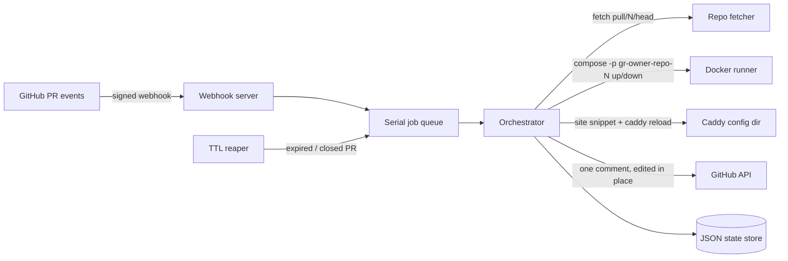

# Greenroom

[English](README.md) | [中文](README.zh.md) | [日本語](README.ja.md)

[](tests) [](LICENSE) [](CHANGELOG.md) [](package.json)

**Open-source, self-hosted preview environments for every pull request — from any docker compose project.**


```bash
git clone https://github.com/JaydenCJ/greenroom.git && cd greenroom && cp .env.example .env && docker compose up -d
```

_The greenroom service itself idles at ~60 MB RSS (measured on Node 22; previews cost whatever your app costs)._

## Why Greenroom?

Preview environments are the feature that keeps teams on Vercel — and the one most self-hosted platforms barely do. Coolify's previews only cover apps deployed on Coolify's own stack, and the demand is loud: the preview-environment issue on Coolify's v5 roadmap (#5685) has collected 663 reactions. If your app already starts with `docker compose up`, you should not need to adopt a whole PaaS to get a URL per pull request.

Greenroom does exactly one thing: install a GitHub webhook, and every PR becomes a disposable compose project with its own basic-auth-protected subdomain, a bot comment with the link, and automatic teardown on merge, close or TTL expiry.

|  | Greenroom | Coolify | Vercel Previews | Shipyard |
|---|---|---|---|---|
| Scope | Preview environments only | Full PaaS; previews are one feature | Feature of the Vercel cloud | Preview environments |
| Self-hosted | Yes | Yes | No | No (SaaS) |
| Works with any docker compose project | Yes | No (apps deployed on Coolify) | No (Vercel build system) | Yes |
| License | MIT | Apache-2.0 (58.1k★) | Proprietary | Proprietary |
| Cost | Free | Free, paid cloud optional | Usage-based | Subscription |

## Features

- **One PR, one environment** — each pull request gets its own `docker compose` project (`gr-<owner>-<repo>-<pr>`), fully isolated, rebuilt on every push; even same-named repos under different owners never collide.
- **A real URL for every PR** — `https://42-acme-demo-app.preview.example.com` via one wildcard DNS record; greenroom reloads Caddy on every change and Caddy issues per-host TLS certificates automatically.
- **Private by default** — every preview sits behind basic auth; the password is generated and printed once at first start, and only its bcrypt hash is stored. No default passwords.
- **Nothing keeps running** — merged, closed or past its TTL means `compose down -v`: containers, networks, volumes and the Caddy site are all reclaimed.
- **One honest bot comment** — a single PR comment, edited in place: status, link, commit and expiry. No comment spam.
- **No PaaS buy-in** — if the repo has a compose file, it works. Greenroom is a single small service plus Caddy, not a platform.

## Quickstart

Try the full lifecycle locally in dry-run mode — no Docker daemon, no domain, no GitHub required:

```bash
git clone https://github.com/JaydenCJ/greenroom.git && cd greenroom
npm ci && npm run build
GREENROOM_DRY_RUN=1 GITHUB_WEBHOOK_SECRET=demo-secret BASE_DOMAIN=preview.example.com npm start
```

In a second terminal, send a signed sample `pull_request` webhook:

```bash
bash scripts/send-sample-webhook.sh
```

Output:

```text
POST http://127.0.0.1:8811/webhook (pull_request.opened.json)
{"ok":true,"queued":"deploy","project":"gr-acme-demo-app-42"}
GET http://127.0.0.1:8811/api/environments
{"environments":[{"project":"gr-acme-demo-app-42","repoFullName":"acme/demo-app",...,"status":"running","subdomain":"42-acme-demo-app.preview.example.com","url":"https://42-acme-demo-app.preview.example.com","port":20000,...,"expiresAt":"2026-07-11T07:14:51.847Z",...}]}
```

Dry-run mode logs the exact `git` and `docker compose` commands instead of executing them, so you can inspect precisely what a real deployment would do.

## Deployment

Requirements: a Linux host with Docker Engine + the compose plugin, and a wildcard DNS record (`*.preview.example.com`) pointing at it.

1. Clone and configure:

   ```bash
   git clone https://github.com/JaydenCJ/greenroom.git && cd greenroom
   cp .env.example .env
   # set GITHUB_WEBHOOK_SECRET (openssl rand -hex 32), BASE_DOMAIN and GITHUB_TOKEN
   ```

2. Start greenroom + Caddy:

   ```bash
   docker compose up -d
   ```

3. Add a webhook to your repo or GitHub App: URL `https://<GREENROOM_PUBLIC_HOST>/webhook`, content type `application/json`, your secret, event **Pull requests**. The optional `GITHUB_TOKEN` (issues: write, pull requests: read) enables bot comments and closed-PR detection.

4. Make the target repo's compose file publish its web service on the port greenroom assigns:

   ```yaml
   services:
     web:
       build: .
       ports:
         - "${GREENROOM_BIND:-127.0.0.1}:${GREENROOM_PORT:-8080}:3000"
   ```

5. Open a pull request. The bot comment appears with the preview link; merging or closing the PR tears the environment down (`compose down -v`), as does the TTL reaper (default 72 h, `TTL_HOURS`).

Operational notes:

- Greenroom binds to `127.0.0.1` by default. The bundled Caddy uses host networking (Linux Docker Engine required), so only Caddy (80/443) faces the network while previews stay published on `127.0.0.1`.
- New and removed preview sites take effect immediately: greenroom runs `CADDY_RELOAD_CMD` (default: `docker exec greenroom-caddy caddy reload ...`) after every snippet change.
- State (environment records, basic auth hash) lives in the `greenroom-data` named volume. Back it up with `docker run --rm -v greenroom_greenroom-data:/data alpine tar cz -C /data . > greenroom-backup.tgz` and restore by extracting into the same volume. PR checkouts live in `/var/lib/greenroom/work`, bind-mounted at the identical path inside the container so relative bind mounts in target compose files resolve correctly; if you change `WORK_DIR`, keep the two paths identical.
- `ALLOWED_REPOS=owner/repo,...` restricts which repositories may trigger deployments; unsigned or tampered webhooks are always rejected (HMAC SHA-256, timing-safe).
- If Caddy runs on the host instead of in compose, include `caddy/*.caddy` from your Caddyfile and set `CADDY_RELOAD_CMD` to something like `systemctl reload caddy` (`PROXY_UPSTREAM_HOST` stays `127.0.0.1`).

## Architecture



Docker, git, the GitHub API and the proxy reload sit behind injected interfaces (`DockerRunner`, `RepoFetcher`, `GithubClient`, `ProxyReloader`); the test suite (127 tests) runs the whole lifecycle against mocks and fixtures without touching the network or a Docker daemon.

## Roadmap

- [x] Core lifecycle: verified webhooks → compose project per PR → subdomain + basic auth → bot comment → TTL/close teardown
- [ ] GitHub App manifest flow for one-click setup
- [ ] Build log streaming per environment
- [ ] Per-environment CPU/memory limits
- [ ] GitLab and Gitea webhook support

See the [open issues](https://github.com/JaydenCJ/greenroom/issues) for the full list.

## Contributing

Contributions are welcome — start with a [good first issue](https://github.com/JaydenCJ/greenroom/issues?q=is%3Aissue+is%3Aopen+label%3A%22good+first+issue%22) or open a [discussion](https://github.com/JaydenCJ/greenroom/discussions). See [CONTRIBUTING.md](CONTRIBUTING.md) for the development setup.

## License

[MIT](LICENSE)
