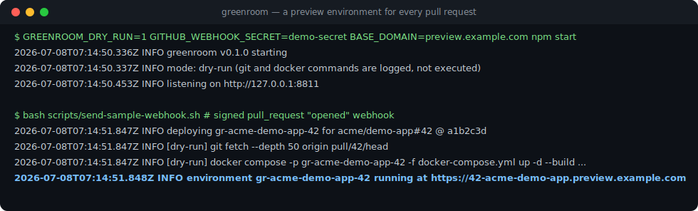
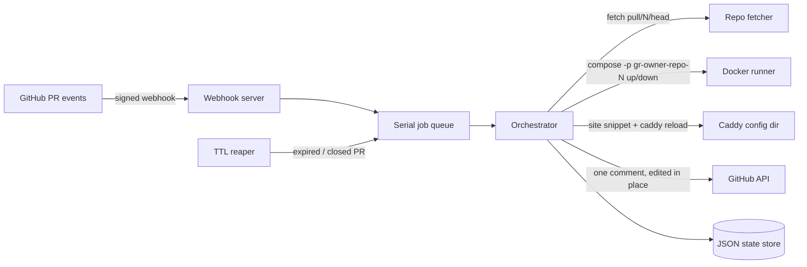

# Greenroom

[English](README.md) | [中文](README.zh.md) | [日本語](README.ja.md)

[](tests) [](LICENSE) [](CHANGELOG.md) [](package.json)

**开源、自托管的 pull request 预览环境——任意 docker compose 项目开箱可用。**



```bash
git clone https://github.com/JaydenCJ/greenroom.git && cd greenroom && cp .env.example .env && docker compose up -d
```

_greenroom 服务本身空闲时约占 60 MB RSS（Node 22 实测；预览环境的开销取决于你的应用本身）。_

## 为什么是 Greenroom？

Preview environment 是把团队留在 Vercel 上最粘的功能，也是多数自托管平台做得最浅的功能。Coolify 的 preview 只覆盖部署在 Coolify 自身栈上的应用，而需求非常真实：Coolify v5 roadmap 上的 preview environment issue（#5685）已积累 663 个 reactions。如果你的应用本来就能 `docker compose up` 启动，就不该为了"每个 PR 一个 URL"再引入一整套 PaaS。

Greenroom 只做一件事：装一个 GitHub webhook，之后每个 PR 自动变成一套一次性的 compose 环境——独立子域名加 basic auth 保护，机器人评论贴出链接，合并、关闭或 TTL 到期即自动回收。

|  | Greenroom | Coolify | Vercel Previews | Shipyard |
|---|---|---|---|---|
| 定位 | Preview environments only | Full PaaS; previews are one feature | Feature of the Vercel cloud | Preview environments |
| 自托管 | Yes | Yes | No | No (SaaS) |
| 任意 docker compose 项目可用 | Yes | No (apps deployed on Coolify) | No (Vercel build system) | Yes |
| 许可证 | MIT | Apache-2.0 (58.1k★) | Proprietary | Proprietary |
| 费用 | Free | Free, paid cloud optional | Usage-based | Subscription |

## 特性

- **一个 PR 一套环境**——每个 pull request 获得独立的 `docker compose` project（`gr-<owner>-<repo>-<pr>`），完全隔离，每次 push 自动重建；不同 owner 下的同名仓库也绝不冲突。
- **每个 PR 一个真实 URL**——一条 wildcard DNS 记录即可获得 `https://42-acme-demo-app.preview.example.com`；greenroom 每次变更后自动 reload Caddy，Caddy 自动为每个域名签发 TLS 证书。
- **默认私有**——所有预览都在 basic auth 之后；密码首次启动时随机生成、只打印一次，磁盘上只保存它的 bcrypt 哈希，没有默认弱密码。
- **不留任何残留**——合并、关闭或 TTL 到期即执行 `compose down -v`：容器、网络、volume 和 Caddy 站点全部回收。
- **一条诚实的机器人评论**——每个 PR 只有一条评论并原地更新：状态、链接、commit、过期时间，不刷屏。
- **零 PaaS 绑定**——仓库里有 compose 文件就能用；greenroom 只是一个小服务加 Caddy，不是一个平台。

## 快速开始

先在本地用 dry-run 模式跑通完整生命周期——不需要 Docker daemon、域名和 GitHub：

```bash
git clone https://github.com/JaydenCJ/greenroom.git && cd greenroom
npm ci && npm run build
GREENROOM_DRY_RUN=1 GITHUB_WEBHOOK_SECRET=demo-secret BASE_DOMAIN=preview.example.com npm start
```

在第二个终端发送一条带合法签名的示例 `pull_request` webhook：

```bash
bash scripts/send-sample-webhook.sh
```

输出：

```text
POST http://127.0.0.1:8811/webhook (pull_request.opened.json)
{"ok":true,"queued":"deploy","project":"gr-acme-demo-app-42"}
GET http://127.0.0.1:8811/api/environments
{"environments":[{"project":"gr-acme-demo-app-42","repoFullName":"acme/demo-app",...,"status":"running","subdomain":"42-acme-demo-app.preview.example.com","url":"https://42-acme-demo-app.preview.example.com","port":20000,...,"expiresAt":"2026-07-11T07:14:51.847Z",...}]}
```

Dry-run 模式会把将要执行的 `git` 与 `docker compose` 命令逐条打印出来而不真正执行，方便审查真实部署到底会做什么。

## 部署

前置要求：一台装有 Docker Engine + compose 插件的 Linux 主机，以及一条指向它的 wildcard DNS 记录（`*.preview.example.com`）。

1. 克隆并配置：

   ```bash
   git clone https://github.com/JaydenCJ/greenroom.git && cd greenroom
   cp .env.example .env
   # set GITHUB_WEBHOOK_SECRET (openssl rand -hex 32), BASE_DOMAIN and GITHUB_TOKEN
   ```

2. 启动 greenroom + Caddy：

   ```bash
   docker compose up -d
   ```

3. 在仓库或 GitHub App 上添加 webhook：URL 填 `https://<GREENROOM_PUBLIC_HOST>/webhook`，content type 选 `application/json`，填入你的 secret，事件勾选 **Pull requests**。可选的 `GITHUB_TOKEN`（issues: write、pull requests: read）用于机器人评论与漏收 close 事件的兜底检测。

4. 让目标仓库的 compose 文件把 web 服务发布到 greenroom 分配的端口上：

   ```yaml
   services:
     web:
       build: .
       ports:
         - "${GREENROOM_BIND:-127.0.0.1}:${GREENROOM_PORT:-8080}:3000"
   ```

5. 开一个 pull request。机器人评论会贴出预览链接；合并或关闭 PR 即触发 `compose down -v` 回收，TTL 回收器（默认 72 小时，`TTL_HOURS`）同样会兜底回收。

运维要点：

- greenroom 默认只绑定 `127.0.0.1`。自带的 Caddy 使用 host networking（需要 Linux 上的 Docker Engine），因此只有 Caddy（80/443）对外，预览端口始终只发布在 `127.0.0.1` 上。
- 新增或删除的预览站点立即生效：每次片段变更后 greenroom 会执行 `CADDY_RELOAD_CMD`（默认 `docker exec greenroom-caddy caddy reload ...`）。
- 状态（环境记录、basic auth 哈希）存放在 named volume `greenroom-data` 中。备份：`docker run --rm -v greenroom_greenroom-data:/data alpine tar cz -C /data . > greenroom-backup.tgz`，恢复时解压回同一 volume 即可。PR 工作副本位于 `/var/lib/greenroom/work`，并以相同路径 bind mount 进容器，这样目标仓库 compose 文件里的相对 bind mount 才能正确解析；如自定义 `WORK_DIR`，容器内外路径必须保持一致。
- `ALLOWED_REPOS=owner/repo,...` 可限制允许触发部署的仓库；无签名或被篡改的 webhook 一律拒绝（HMAC SHA-256，恒定时间比较）。
- 如果 Caddy 跑在宿主机而非 compose 里，在你的 Caddyfile 中 import `caddy/*.caddy`，并把 `CADDY_RELOAD_CMD` 设为类似 `systemctl reload caddy` 的命令（`PROXY_UPSTREAM_HOST` 保持 `127.0.0.1`）。

## 架构



Docker、git、GitHub API 与代理 reload 全部隐藏在注入式接口之后（`DockerRunner`、`RepoFetcher`、`GithubClient`、`ProxyReloader`）；测试套件（127 个测试）用 mock 与 fixture 跑完整生命周期，全程不出网、不依赖 Docker daemon。

## 路线图

- [x] 核心生命周期：验签 webhook → 每 PR 一个 compose project → 子域名 + basic auth → 机器人评论 → TTL/关闭回收
- [ ] GitHub App manifest 一键安装流程
- [ ] 每个环境的构建日志流式查看
- [ ] 每个环境的 CPU/内存限额
- [ ] GitLab 与 Gitea webhook 支持

完整列表见 [open issues](https://github.com/JaydenCJ/greenroom/issues)。

## 参与贡献

欢迎贡献——从 [good first issue](https://github.com/JaydenCJ/greenroom/issues?q=is%3Aissue+is%3Aopen+label%3A%22good+first+issue%22) 入手，或到 [Discussions](https://github.com/JaydenCJ/greenroom/discussions) 发起讨论。开发环境搭建见 [CONTRIBUTING.md](CONTRIBUTING.md)。

## 许可证

[MIT](LICENSE)
